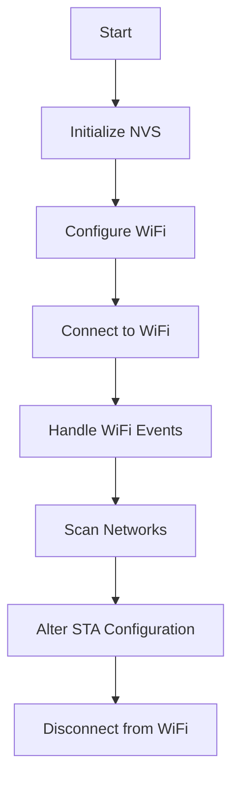

# WiFi API

## Overview
The WiFi API component provides functionalities to configure, connect, and manage Wi-Fi connections on the ESP32. It includes functions for scanning available networks, altering station configurations, and handling Wi-Fi events such as connection, disconnection, and IP acquisition.

## How It Works


### Workflow Description
1. **Initialize NVS**: The Non-Volatile Storage (NVS) is initialized to store Wi-Fi credentials persistently.
2. **Configure Wi-Fi**: Sets up the ESP32 Wi-Fi station (STA) interface and registers event handlers.
3. **Connect to Wi-Fi**: Connects to the specified access point (AP) using provided SSID and password.
Handle Wi-Fi Events: Manages events like successful connection, disconnection, and IP acquisition.
Scan Networks: Scans for available Wi-Fi networks and retrieves their details.
Alter STA Configuration: Dynamically updates the SSID and password for the Wi-Fi STA mode and reconnects.
Disconnect from Wi-Fi: Cleans up resources and disconnects from the current AP.

## External Dependencies
- **ESP-IDF**: Provides the necessary libraries and tools for ESP32 development.
- **FreeRTOS**: Used for task management and synchronization.
- **NVS Flash**: Used for storing WiFi credentials.

## Requirements
The target network must be a router and configured to use `WIFI_AUTH_WPA_WPA2_PSK` security and 2.4GHz frequency band.

## How to Use
Include the WiFi API module in your project by adding it to your `CMakeLists.txt`:
```cmake
idf_component_register(SRCS "wifi_api.c"
                    INCLUDE_DIRS "include"
                    REQUIRES wifi_api)
```

## CMake Options
- `REQUIRES`: Other components depending on your component will also inherit these dependencies, i.e., can be used in header files.

## WiFi Setup
To configure the WiFi credentials create a folder named `secrets` in the root of the application and create a file named `wifi_secrets.h` with the following content:
```c
#ifndef WIFI_SECRETS_H
#define WIFI_SECRETS_H

#define WIFI_SSID "your wifi ssid"
#define WIFI_PASSWORD "your wifi password"

#endif // WIFI_SECRETS_H
```
**NOTES**:
- The `secrets` folder is added to the `.gitignore` file so that it is not committed to the repository.
- If you will use any functions from the WiFi API into interrupt context, you should remove the logs in respective functions.

## Future Implementations
1. Improve the log information.
2. Add support for 5GHz frequency band.
3. Add support for other security types.
4. Implement in all functions the `esp_err_t` return type.

## References
- [WiFi API](https://docs.espressif.com/projects/esp-idf/en/v5.3.1/esp32/api-guides/wifi.html)
- [WiFi Example](https://github.com/espressif/esp-idf/tree/master/examples/wifi/getting_started/station)
